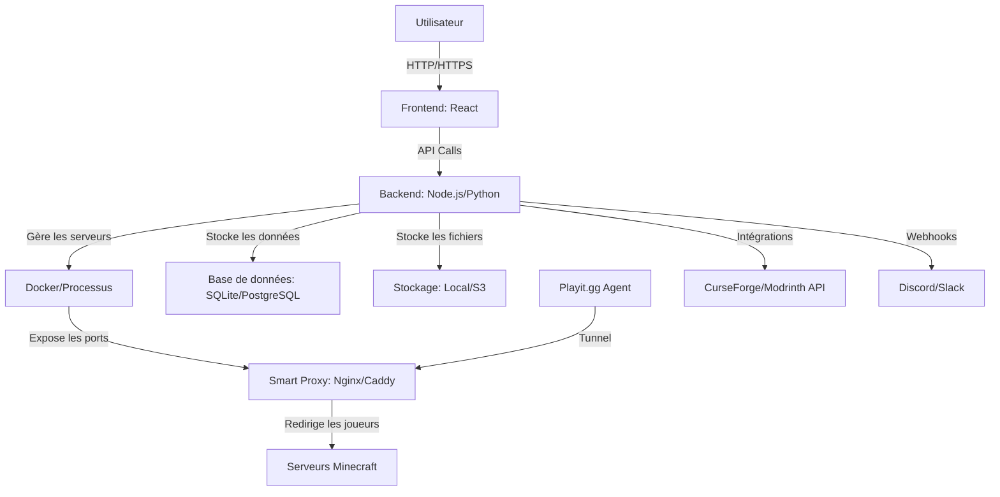

## **Cahier des Charges – Nutty Panel**
**Version 1.0 – Ultimate Minecraft Self-Hosted Panel**
*Par Cacahouetes*

---

### **1. Introduction**
**Contexte** :
Les panels Minecraft existants (comme Pterodactyl, AMP, ou MinePanel) manquent souvent de simplicité pour les débutants **ou** de fonctionnalités avancées pour les experts. Nutty Panel vise à combler ce fossé en offrant une solution **tout-en-un**, **self-hosted**, et **ultra-personnalisable**, accessible à tous les niveaux d’utilisateurs.

**Public cible** :
- **Novices** : Utilisateurs sans expérience technique, souhaitant héberger un serveur Minecraft rapidement.
- **Utilisateurs intermédiaires** : Joueurs voulant gérer plusieurs serveurs avec des mods/plugins.
- **Power Users / Experts** : Administrateurs système souhaitant intégrer Docker, automatiser des tâches, ou utiliser des APIs pour des workflows personnalisés.

---

### **2. Objectifs Principaux**
| **Objectif** | **Description** | **Priorité** |
|--------------|----------------|--------------|
| **Simplicité** | Installation et utilisation intuitive pour les débutants (1 clic pour démarrer un serveur). | ⭐⭐⭐⭐⭐ |
| **Flexibilité** | Prise en charge des besoins avancés (Docker, APIs, scripts personnalisés). | ⭐⭐⭐⭐⭐ |
| **Compatibilité** | Support de toutes les versions de Minecraft (Vanilla, Bedrock, Snapshots, etc.). | ⭐⭐⭐⭐⭐ |
| **Automatisation** | Réduire l’intervention manuelle (backups, mises à jour, gestion des ressources). | ⭐⭐⭐⭐ |
| **Intégrations** | Compatibilité native avec Playit.gg, CurseForge, Modrinth, Docker, etc. | ⭐⭐⭐⭐ |
| **Localisation** | Panel et documentation disponibles en anglais (par défaut) et français. | ⭐⭐⭐ |

---

### **3. Contraintes Techniques et Fonctionnelles**

#### **3.1 Contraintes Générales**
- **Self-hosted** : 100% hébergé par l’utilisateur (pas de cloud propriétaire).
- **Multi-OS** : Compatible avec Ubuntu Server, Debian, CentOS, et autres distributions Linux. *Optionnel* : Support de Windows Server.
- **Langues** :
  - Interface et documentation **par défaut en anglais**.
  - Option pour basculer en français (fichiers de localisation séparés).
- **Open Source** : Code disponible sur GitHub (licence MIT ou GPLv3).
- **Performances** : Optimisé pour tourner sur du matériel modeste (ex: VPS à 2Go de RAM).

#### **3.2 Contraintes de Sécurité**
- **Isolation des serveurs** : Chaque serveur Minecraft doit être isolé (conteneurs Docker ou utilisateurs système dédiés).
- **Gestion des permissions** :
  - Rôles utilisateurs (Admin, Modérateur, Joueur) avec accès granulaire.
  - Authentification forte (2FA optionnel, clés API pour les intégrations).
- **Chiffrement** :
  - HTTPS obligatoire pour l’interface web (Let’s Encrypt ou certificats personnalisés).
  - Stockage sécurisé des mots de passe (bcrypt ou Argon2).
- **Protection DDoS** : Intégration possible avec Cloudflare ou fail2ban.

#### **3.3 Contraintes de Scalabilité**
- **Multi-serveurs** : Gestion de plusieurs instances Minecraft sur une seule machine.
- **Load Balancing** : Répartition automatique des joueurs entre les serveurs (via Smart Proxy).
- **Limites de ressources** : Configuration des limites CPU/RAM par serveur pour éviter les abus.

---

### **4. Fonctionnalités (Features)**
#### **4.1 Fonctionnalités de Base**
| **Fonctionnalité** | **Description** | **Public Cible** |
|--------------------|----------------|------------------|
| **Installation simplifiée** | Script d’installation automatique (ex: `bash <(curl -s https://nutty-panel.com/install.sh)`). | Novices |
| **Interface Web** | Dashboard moderne (React/Vue.js + backend en Node.js/Python) avec thème sombre/clair. | Tous |
| **Création de serveurs** | Assistant guidé pour créer un serveur (version, type, mods, etc.). | Novices/Intermédiaires |
| **Gestion des versions** | Support de toutes les versions de Minecraft (y compris Snapshots et Bedrock). | Tous |
| **Console interactive** | Accès à la console du serveur en temps réel (avec historique et commandes pré-enregistrées). | Tous |
| **Gestion des fichiers** | Éditeur de fichiers intégré (pour `server.properties`, `spigot.yml`, etc.) + upload via drag & drop. | Intermédiaires/Experts |

#### **4.2 Fonctionnalités Avancées**
| **Fonctionnalité** | **Description** | **Public Cible** |
|--------------------|----------------|------------------|
| **Intégration Docker** | Option pour déployer les serveurs dans des conteneurs Docker (avec Docker Compose). | Experts |
| **Smart Proxy** | Gestion dynamique des ports : un seul port/tunnel ouvert (ex: 25565), redirection automatique vers les serveurs. | Tous |
| **Playit.gg Native** | Onglet dédié avec :
- Installation automatique de l’agent Playit.gg.
- Détection de l’agent et création de tunnels.
- Gestion des tunnels (start/stop/monitor). | Tous |
| **Gestion des Mods/Plugins** | Intégration avec :
- **CurseForge** : Installation de mods/modpacks en 1 clic.
- **Modrinth** : Support des datapacks, plugins, et modpacks.
- Mises à jour automatiques ou manuelles. | Intermédiaires/Experts |
| **Backups** | Système de sauvegarde :
- **Automatique** : Planifiable (ex: tous les jours à 3h).
- **Manuelle** : Bouton "Backup Now".
- Stockage local ou distant (SFTP, S3, Google Drive).
- Restauration en 1 clic. | Tous |
| **Auto-Start/Pause/Stop** | Comportement intelligent :
- **Auto-start** : Le serveur démarre si un joueur tente de se connecter.
- **Auto-pause** : Le serveur se met en pause après X minutes d’inactivité.
- **Auto-stop** : Le serveur s’éteint après Y minutes en pause (économise les ressources). | Tous |
| **API REST** | Pour permettre aux experts d’intégrer Nutty Panel à leurs outils (ex: Discord Bot, CI/CD). | Experts |
| **Webhooks** | Notifications Discord/Slack pour les événements (ex: serveur démarré, backup terminé). | Intermédiaires/Experts |
| **Metrics & Monitoring** | Tableau de bord avec :
- Utilisation CPU/RAM.
- Nombre de joueurs en ligne.
- Logs en temps réel. | Tous |

#### **4.3 Fonctionnalités Bonus (Future-Proof)**
| **Fonctionnalité** | **Description** | **Priorité** |
|--------------------|----------------|--------------|
| **Marketplace** | Boutique intégrée pour télécharger des configs/plugins/mods pré-validés. | ⭐⭐ |
| **Multi-utilisateurs** | Permettre à plusieurs utilisateurs de gérer leurs serveurs sur la même instance. | ⭐⭐⭐ |
| **Support Multi-Jeux** | Étendre à d’autres jeux (ex: Valheim, Terraria) via des modules. | ⭐ |
| **IA Assistant** | Chatbot intégré pour aider à configurer le serveur (ex: "Comment installer un mod ?"). | ⭐⭐ |
| **Thèmes personnalisables** | Permettre aux utilisateurs de personnaliser l’interface (CSS/JS). | ⭐ |

---

### **5. Architecture Technique**
#### **5.1 Stack Recommandée**
| **Composant** | **Technologie** | **Justification** |
|---------------|----------------|------------------|
| **Frontend** | React.js + TypeScript + Tailwind CSS | Moderne, réactif, facile à étendre. |
| **Backend** | Node.js (Express/NestJS) ou Python (FastAPI) | Léger, performant, bonne communauté. |
| **Base de données** | SQLite (pour les petites instances) ou PostgreSQL (pour le multi-utilisateurs). | Fiable et scalable. |
| **Stockage des fichiers** | Système de fichiers local + option S3/MinIO pour les backups. | Flexible. |
| **Gestion des serveurs** | Docker (pour l’isolation) + scripts Bash/Python pour les commandes. | Portable et sécurisé. |
| **Proxy** | Nginx ou Caddy (pour le reverse proxy et HTTPS). | Performant et simple à configurer. |

#### **5.2 Schéma d’Architecture**

---

### **6. Sécurité et Bonnes Pratiques**
- **Mises à jour automatiques** : Vérification des mises à jour de Minecraft, des mods, et du panel lui-même.
- **Audit des logs** : Journalisation de toutes les actions (qui a démarré/arrêté un serveur ?).
- **Sandboxing** : Les serveurs Minecraft tournent dans des environnements isolés (Docker ou utilisateurs système dédiés).
- **Rate Limiting** : Protection contre les attaques par force brute sur l’interface de login.
- **CVE Monitoring** : Vérification régulière des vulnérabilités dans les dépendances (via Dependabot ou Snyk).

---

### **7. Documentation**
#### **7.1 Structure de la Documentation**
- **Guide d’installation** :
  - Prérequis (ex: Ubuntu 22.04, Docker, Node.js 18+).
  - Installation via script ou manuelle.
  - Configuration initiale (mot de passe admin, domaine, etc.).
- **Guide utilisateur** :
  - Créer son premier serveur.
  - Installer des mods/modpacks.
  - Configurer les backups.
- **Guide avancé** :
  - Intégration avec Docker.
  - Utilisation de l’API.
  - Personnalisation du Smart Proxy.
- **FAQ** : Réponses aux problèmes courants (ex: "Le serveur ne démarre pas").
- **API Reference** : Documentation Swagger/OpenAPI pour les développeurs.

#### **7.2 Formats**
- **Site web dédié** (ex: `docs.nutty-panel.com`) généré avec [Docusaurus](https://docusaurus.io/) ou [MkDocs](https://www.mkdocs.org/).
- **Fichiers Markdown** dans le dépôt GitHub pour les contributeurs.
- **Vidéos tutoriels** (optionnel) pour les novices.

---

### **8. Roadmap et Priorités**
| **Phase** | **Objectifs** | **Échéance** | **Statut** |
|-----------|--------------|--------------|------------|
| **Phase 1 (MVP)** | Fonctionnalités de base (création de serveurs, console, backups manuels). | 3 mois | ⬜ À faire |
| **Phase 2** | Intégration Docker, Smart Proxy, Playit.gg, CurseForge/Modrinth. | 2 mois | ⬜ À faire |
| **Phase 3** | Auto-start/pause/stop, API, webhooks, documentation complète. | 2 mois | ⬜ À faire |
| **Phase 4** | Multi-utilisateurs, marketplace, support multi-jeux. | 3 mois | ⬜ Backlog |

---

### **9. Exemples de Cas d’Usage**
#### **9.1 Novice : Premier Serveur Vanilla**
1. L’utilisateur installe Ubuntu Server sur un VPS.
2. Il exécute le script d’installation de Nutty Panel.
3. Il accède à l’IP du panel via son navigateur.
4. Il clique sur **"Create Server"**, choisit **Vanilla 1.20.4**, et lance le serveur.
5. Il partage l’IP du serveur avec ses amis.

#### **9.2 Expert : Déploiement Docker + Modpack CurseForge**
1. L’expert installe Nutty Panel avec Docker Compose.
2. Il crée un nouveau serveur, sélectionne **"Fabric 1.20.4"** et installe le modpack **"RLCraft"** via CurseForge.
3. Il configure les limites de RAM/CPU pour le conteneur Docker.
4. Il active le **Smart Proxy** pour gérer plusieurs serveurs sur le port 25565.
5. Il utilise l’**API** pour automatiser le redémarrage des serveurs via un script Python.

---

### **10. Questions Ouvertes et Décisions à Prendre**
- **Technologie backend** : Node.js (plus rapide pour le temps réel) ou Python (plus simple pour les scripts) ?
- **Gestion des mods** : Faut-il supporter les mods **Forge**, **Fabric**, **Spigot**, **Paper** dès le début ?
- **Monétisation** : Faut-il prévoir un modèle freemium (ex: features avancées payantes) ou 100% open source ?
- **Communauté** : Créer un Discord/forum pour le support utilisateur ?

---

### **11. Annexes**
- **Benchmark** : Comparatif avec Pterodactyl, AMP, MinePanel (à ajouter plus tard).
- **Mockups** : Maquettes de l’interface (Figma/Adobe XD).
- **Exemples de configs** : Fichiers `docker-compose.yml`, `nginx.conf`, etc.

---

### **Prochaines Étapes**
1. **Valider la stack technique** (backend/frontend/base de données).
2. **Créer un prototype** du MVP (ex: interface basique + création de serveur).
3. **Ouvrir un dépôt GitHub** pour collaborer avec la communauté.
4. **Recruter des bêta-testeurs** (novices et experts) pour les feedbacks.